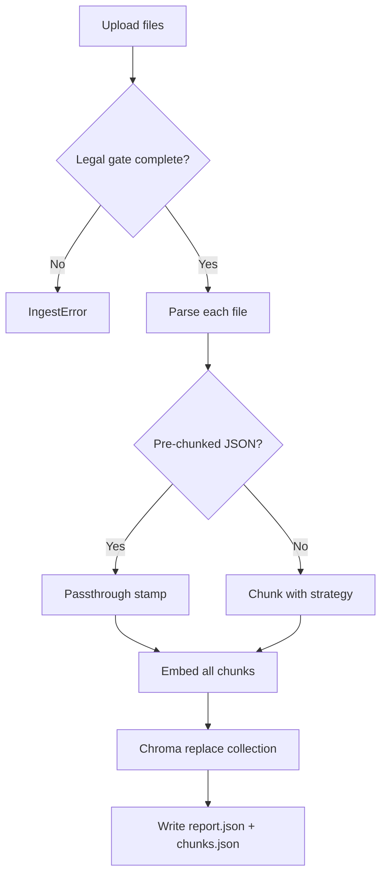

# Ragroog Architecture & User Guide

Ragroog is an offline **corpus factory** for clinical guideline RAG. It turns uploaded documents into a searchable vector index with citation-ready metadata. The current release (Day 1) covers indexing and retrieval verification only — there is no LLM answer generation yet.

```
Upload → legal gate → parse (+ OCR fallback) → chunk → local embeddings → Chroma → smoke query (top-n)
```

The clinical topic lives in your uploaded corpus and metadata, not in hardcoded disease logic. Every indexed chunk carries fields needed for future grounded citations: `document_name`, `section_title`, `page_number`, and `chunk_id`.

---

## Table of Contents

1. [What Ragroog Does Today](#what-ragroog-does-today)
2. [Architecture Overview](#architecture-overview)
3. [Data Flow](#data-flow)
4. [Components](#components)
5. [Storage](#storage)
6. [Configuration](#configuration)
7. [User Guide](#user-guide)
8. [Development & Testing](#development--testing)
9. [Roadmap](#roadmap)

---

## What Ragroog Does Today

| Capability | Status |
|------------|--------|
| Multi-format ingest (PDF, MD, TXT, JSON) | ✅ |
| OCR fallback for scanned PDFs | ✅ |
| Four chunking strategies | ✅ |
| Local embeddings (`BAAI/bge-m3`) | ✅ |
| Chroma vector index with citation metadata | ✅ |
| Smoke query (dense retrieval, top-k) | ✅ |
| Streamlit operator UI | ✅ |
| CLI ingest script | ✅ |
| LLM answer generation | ❌ Day 3 |
| Hybrid search / reranking | ❌ Day 2 |
| Safety dashboard / faithfulness metrics | ❌ Day 4 |

**Non-goals in this slice:** Ragroog is a team/dev operator tool, not a patient-facing clinical product. The Streamlit UI is for building and inspecting indexes, not for clinical decision support.

---

## Architecture Overview

Ragroog is a Python package (`clinical_rag`) with two entry points — a Streamlit UI and a CLI script — both calling the same pipeline modules.

```
┌─────────────────────────────────────────────────────────────────┐
│                         Entry Points                            │
│  ┌──────────────────────┐    ┌──────────────────────────────┐  │
│  │  Streamlit UI        │    │  scripts/build_index.py      │  │
│  │  streamlit_app.py    │    │  (CLI twin)                  │  │
│  └──────────┬───────────┘    └──────────────┬───────────────┘  │
└─────────────┼───────────────────────────────┼───────────────────┘
              │                               │
              ▼                               ▼
┌─────────────────────────────────────────────────────────────────┐
│                         Pipeline                                │
│  ┌─────────────────┐         ┌─────────────────────────────┐   │
│  │  run_ingest()   │         │  run_smoke_query()          │   │
│  │  pipeline/      │         │  pipeline/smoke_query.py    │   │
│  │  ingest.py      │         └─────────────────────────────┘   │
│  └────────┬────────┘                                            │
└───────────┼─────────────────────────────────────────────────────┘
            │
    ┌───────┼───────┬───────────┬──────────┐
    ▼       ▼       ▼           ▼          ▼
┌───────┐ ┌─────┐ ┌───────┐ ┌────────┐ ┌────────┐
│Parsing│ │Chunk│ │Embed  │ │ Chroma │ │ Config │
│router │ │ing  │ │der    │ │ store  │ │schemas │
└───────┘ └─────┘ └───────┘ └────────┘ └────────┘
```

### Tech Stack

| Layer | Technology |
|-------|------------|
| Language | Python 3.11–3.13 (repo pins 3.12) |
| Package manager | [uv](https://docs.astral.sh/uv/) |
| Validation | Pydantic v2, pydantic-settings |
| PDF parsing | PyMuPDF (`pymupdf`) |
| OCR | pytesseract + system Tesseract (optional) |
| Embeddings | sentence-transformers + PyTorch |
| Vector DB | ChromaDB (persistent, cosine HNSW) |
| UI | Streamlit |
| Tests | pytest |

### Repository Layout

```
ragroog/
├── src/clinical_rag/
│   ├── config.py              # Settings, collection naming, device detection
│   ├── schemas.py             # Pydantic data contracts
│   ├── errors.py              # IngestError
│   ├── parsing/               # Format-specific parsers + OCR
│   ├── chunking/              # fixed, section_aware, hierarchical, passthrough
│   ├── indexing/              # embed.py, chroma_store.py
│   ├── pipeline/              # ingest.py, smoke_query.py
│   └── ui/streamlit_app.py    # 4-tab operator UI
├── scripts/build_index.py     # CLI entry point
├── data/guidelines/           # Sample demo corpora (committed)
├── data/uploads/              # Runtime uploads (gitignored)
├── artifacts/
│   ├── indexes/chroma/        # Chroma persistent storage (gitignored)
│   └── jobs/<job_id>/         # report.json, chunks.json, parsed/ (gitignored)
├── tests/
└── docs/
```

---

## Data Flow

### Ingest Pipeline

`run_ingest()` in `pipeline/ingest.py` orchestrates the full indexing flow:



**Stages:**

1. **Legal gate** — All four `LegalFlags` must be true before ingest proceeds.
2. **Parse** — Route by file suffix; PDFs may trigger per-page OCR fallback.
3. **Chunk** — Apply the configured strategy (or passthrough for pre-chunked JSON).
4. **Embed** — Encode chunk texts with the configured sentence-transformer model.
5. **Store** — Replace the target Chroma collection (idempotent rebuild).
6. **Report** — Persist job artifacts under `artifacts/jobs/<job_id>/`.

### Retrieval (Smoke Query)

Smoke query verifies the index works. It does **not** generate answers.

1. Embed the query with the **same model** used at index time.
2. Query Chroma for top-k nearest neighbors (cosine distance).
3. Convert distance to score: `score = 1.0 - distance`.
4. Return `SmokeHit` objects with citation metadata.

### Collection Naming

Each index is stored in a Chroma collection named:

```
{corpus_id}__{strategy_id}__{embed_model_slug}
```

Example: `demo__section_aware__BAAI_bge-m3`

Separate collections per strategy and embedding model enable fair A/B comparison without re-ingesting source files.

---

## Components

### Parsing (`parsing/`)

The parse router dispatches by file suffix:

| Format | Handler | Notes |
|--------|---------|-------|
| `.pdf` | `pdf_pymupdf.py` | Text extraction + font-size heading detection; OCR fallback per page |
| `.md`, `.txt` | `text_plain.py` | UTF-8 read; markdown `#` headings and heuristic section detection |
| `.json` (raw) | `json_doc.py` | Expects `pages[]` or `sections[]` |
| `.json` (pre-chunked) | `json_prechunked.py` | Detects `chunks[]` with `text` fields; skips chunker |

**PDF OCR fallback** (`pdf_ocr_tesseract.py`):

- Triggered when a page fails the quality gate (< 50 chars or < 30% alphanumeric).
- Page rasterized at 250 DPI, processed by Tesseract.
- OCR text cached at `artifacts/jobs/<job_id>/parsed/<doc_id>_p<N>.txt`.

**Parser profiles:**

| Profile | Behavior |
|---------|----------|
| `text_only` | Never run OCR |
| `ocr_fallback` | OCR only on low-quality pages (default) |
| `ocr_all` | OCR every PDF page |

### Chunking (`chunking/`)

| Strategy | Description | Default params |
|----------|-------------|----------------|
| `section_aware` | Group by headings, pack to target size, split oversized sections with overlap | 400 tokens, 12% overlap |
| `fixed` | Sliding token windows across the full document | 400 tokens, 12% overlap |
| `hierarchical` | Parent windows (~800 tokens) with child windows (~350); **only children are indexed** | configurable |
| `passthrough` | Pre-chunked JSON only; no re-chunking | n/a |

Token counting uses a character-based estimate (~4 chars/token), sufficient for 300–500 token window packing.

**Every chunk is stamped with:**

- Citation fields: `chunk_id`, `document_name`, `section_title`, `page_number`
- Provenance: `source_url`, `filename`, `doc_id`, `extraction_method`
- Indexing context: `strategy_id`, `corpus_id`, `job_id`, `token_count`, `embed_model_id`
- Hierarchical: `parent_chunk_id` (when applicable)

PDF-derived chunks **must** include `page_number` (enforced by schema validation).

### Embedding (`indexing/embed.py`)

- **Primary model:** `BAAI/bge-m3` via sentence-transformers
- **Fallback:** `BAAI/bge-small-en-v1.5` if the primary model fails to load
- **Device:** auto-detects CUDA → MPS → CPU
- **Normalization:** `normalize_embeddings=True` (cosine-ready vectors)
- **Batch size:** 16 (configurable)

The same embedder instance encodes both index chunks and smoke-query text.

### Chroma Store (`indexing/chroma_store.py`)

- Persistent client at `artifacts/indexes/chroma/`
- Collection metadata: `hnsw:space: cosine`
- Upsert: `ids` = `chunk_id`, `documents` = chunk text, `metadatas` = full citation fields
- **Rebuild policy:** `replace()` deletes the existing collection then upserts — reruns with the same corpus/strategy/model name do not duplicate chunks

### Schemas (`schemas.py`)

All data contracts are Pydantic models. Key types:

- `RawDocument` — uploaded file with legal flags and metadata
- `ParsedDocument` / `ParsedPage` — parser output
- `Chunk` — indexed unit with citation metadata
- `IngestJobConfig` — full job configuration
- `IngestReport` — job summary written to `report.json`
- `SmokeHit` — retrieval result with score and citation fields

### Error Handling

A single exception type, `IngestError`, covers operator-facing failures:

- Incomplete legal checklist
- Unsupported file types
- Parse errors / invalid JSON
- Empty corpus (no chunks produced)
- Missing Tesseract when OCR is required
- Embedding model load failures

---

## Storage

Ragroog uses file-based persistence — no traditional database.

| Storage | Location | Purpose | Gitignored |
|---------|----------|---------|------------|
| ChromaDB | `artifacts/indexes/chroma/` | Vector embeddings + chunk metadata + document text | Yes |
| Job artifacts | `artifacts/jobs/<job_id>/` | `report.json`, `chunks.json`, `parsed/` OCR cache | Yes |
| Upload staging | `data/uploads/<job_id>/` | Files uploaded via Streamlit | Yes |
| Sample data | `data/guidelines/` | Committed synthetic demo corpora | No |

### Job Artifacts

Each ingest job produces:

```
artifacts/jobs/<job_id>/
├── report.json       # Summary: chunk count, collection name, warnings, rationale
├── chunks.json       # Full chunk payloads (all metadata + text)
└── parsed/           # OCR text cache per PDF page
    └── <doc_id>_p1.txt
```

### Chroma Metadata Schema

Each vector stores these metadata fields:

```
chunk_id, document_name, section_title, page_number,
source_url, strategy_id, corpus_id, job_id, extraction_method,
token_count, embed_model_id, filename, doc_id, parent_chunk_id
```

---

## Configuration

Settings are loaded from environment variables (via `.env`) and pydantic-settings, with nested keys using double underscores.

Copy the template to get started:

```bash
cp .env.example .env
```

### Environment Variables

| Variable | Default | Purpose |
|----------|---------|---------|
| `SMOKE_QUERY__TOP_K` | `5` | Default smoke query result count |
| `PARSER__PROFILE` | `ocr_fallback` | `text_only` / `ocr_fallback` / `ocr_all` |
| `PARSER__OCR_LANG` | `eng` | Tesseract language |
| `PARSER__OCR_DPI` | `250` | PDF rasterization DPI |
| `PARSER__MIN_CHARS` | `50` | OCR quality gate: minimum characters |
| `PARSER__MIN_ALNUM_RATIO` | `0.3` | OCR quality gate: minimum alphanumeric ratio |
| `CHUNK__STRATEGY_ID` | `section_aware` | Default chunk strategy |
| `CHUNK__TARGET_TOKENS` | `400` | Target chunk size |
| `CHUNK__OVERLAP_RATIO` | `0.12` | Overlap fraction (~10–15%) |
| `CHUNK__MIN_TOKENS` | `120` | Minimum section size |
| `CHUNK__MAX_TOKENS` | `520` | Maximum before window split |
| `CHUNK__CHILD_TOKENS` | `350` | Hierarchical child window size |
| `CHUNK__PARENT_TOKENS` | `800` | Hierarchical parent window size |
| `EMBED__MODEL_ID` | `BAAI/bge-m3` | Embedding model |
| `EMBED__FALLBACK_MODEL_ID` | `BAAI/bge-small-en-v1.5` | Fallback on OOM / load failure |
| `EMBED__DEVICE` | `auto` | `auto` / `cpu` / `cuda` / `mps` |
| `EMBED__BATCH_SIZE` | `16` | Encode batch size |
| `CHROMA__PERSIST_DIR` | `artifacts/indexes/chroma` | Chroma storage path |

The Streamlit UI and CLI flags override these per-run (strategy, parser profile, embed model, token sizes, device).

---

## User Guide

### Prerequisites

- Python 3.11–3.13 (3.12 recommended)
- [uv](https://docs.astral.sh/uv/) package manager
- Optional: Tesseract OCR for scanned PDFs

### Installation

```bash
cd ragroog
uv sync --extra dev
```

**Optional OCR** (Fedora example):

```bash
sudo dnf install tesseract tesseract-langpack-eng
```

On first run, the embedding model (`BAAI/bge-m3`, ~2 GB) is downloaded by sentence-transformers.

### Quick Start (CLI)

Index a sample guideline and run a smoke query:

```bash
uv run python scripts/build_index.py --confirm-legal \
  --corpus-id demo \
  --smoke-query "first-line hypertension treatment" \
  data/guidelines/sample_hypertension.md
```

This prints a JSON ingest report to stdout, followed by tab-separated smoke hits:

```
0.842  demo-sample-hypertension-001  Sample Hypertension  First-line treatment  p1
```

### Quick Start (Streamlit UI)

```bash
uv run streamlit run src/clinical_rag/ui/streamlit_app.py
```

Open the URL shown in the terminal (typically `http://localhost:8501`).

---

### Streamlit UI Walkthrough

The UI has four tabs.

#### Tab 1: Ingest

Build a new index from uploaded files.

1. **Upload** one or more files: PDF, MD, TXT, or JSON.
2. Set a **corpus_id** (e.g. `demo`, `hypertension-v2`). This groups related documents and appears in the collection name.
3. Complete all **four legal checkboxes**:
   - Open access / reusable
   - OK to index (redistribution permitted)
   - Edition current
   - Attribution documented
4. For each file, optionally set `document_name` and `source_url`.
5. Configure pipeline knobs:
   - Parser profile (`ocr_fallback` recommended for mixed PDFs)
   - Chunk strategy (`section_aware` recommended)
   - Embedding model (`BAAI/bge-m3` default)
   - Target tokens, overlap ratio, device
6. Optionally edit the chunk and embed **rationale** text (saved in the job report).
7. Click **Build index**.

Progress messages appear for each stage: parse → OCR → chunk → embed → store.

On success, the summary shows chunk count, page count, OCR page count, and the Chroma collection name.

#### Tab 2: Browse Chunks

Inspect what was indexed.

1. Select a job from the dropdown (sorted newest first).
2. Filter by document name, strategy, or extraction method.
3. Expand any row to view full metadata and chunk text.

Use this tab to verify heading preservation, page numbers, and chunk sizes before trusting retrieval results.

#### Tab 3: Smoke Query

Test retrieval against an existing index.

1. Select a job.
2. Enter a natural-language query.
3. Set `top_k` (1–50, default 5).
4. Click **Run smoke query**.

Results show a score, citation fields, and expandable full text. Higher scores indicate closer cosine similarity to the query.

**Important:** Smoke query returns retrieved chunks only. It does not synthesize an answer.

#### Tab 4: Job Report

Review and edit job metadata.

1. Select a job.
2. View or download `report.json`.
3. Edit and save chunk/embed rationale text.

---

### CLI Reference

```bash
uv run python scripts/build_index.py [OPTIONS] FILE [FILE ...]
```

| Flag | Default | Description |
|------|---------|-------------|
| `--corpus-id` | `demo` | Corpus identifier (appears in collection name) |
| `--strategy` | `section_aware` | `fixed`, `section_aware`, `hierarchical`, `passthrough` |
| `--parser-profile` | `ocr_fallback` | `text_only`, `ocr_fallback`, `ocr_all` |
| `--embed-model` | `BAAI/bge-m3` | sentence-transformers model ID |
| `--source-url` | `""` | Applied to all input files |
| `--confirm-legal` | (required) | Attest all four legal flags |
| `--smoke-query` | `""` | Optional query to run after ingest |
| `--top-k` | from config | Smoke query result count (0 = use config default) |

**Examples:**

Index multiple files with a custom strategy:

```bash
uv run python scripts/build_index.py --confirm-legal \
  --corpus-id guidelines-v1 \
  --strategy hierarchical \
  --parser-profile ocr_fallback \
  data/guidelines/sample_hypertension.md \
  data/guidelines/sample_diabetes_raw.json
```

Index pre-chunked JSON (uses passthrough automatically):

```bash
uv run python scripts/build_index.py --confirm-legal \
  --corpus-id demo \
  --smoke-query "asthma rescue inhaler" \
  data/guidelines/sample_asthma_prechunked.json
```

---

### Supported File Formats

#### PDF (`.pdf`)

PyMuPDF extracts text and detects headings by font size. Pages that fail the quality gate are OCR'd with Tesseract. Every chunk from a PDF includes a `page_number`.

#### Markdown / Plain Text (`.md`, `.txt`)

Read as UTF-8. Headings detected via `#` markdown syntax, numbered headings, or ALL CAPS lines.

#### JSON — Raw (`.json`)

Expects a payload with either `pages[]` or `sections[]`:

```json
{
  "document_name": "Diabetes Guideline",
  "pages": [
    { "page_number": 1, "text": "..." }
  ]
}
```

Parsed content is then chunked with the configured strategy.

#### JSON — Pre-chunked (`.json`)

Detected when the payload has a `chunks[]` array with `text` fields:

```json
{
  "document_name": "Asthma Guideline",
  "chunks": [
    {
      "text": "...",
      "section_title": "Rescue therapy",
      "page_number": 3
    }
  ]
}
```

Pre-chunked JSON bypasses the chunker (passthrough strategy) and goes directly to embedding.

---

### Legal Gate

Ingest is blocked until all four legal flags are confirmed:

| Flag | Meaning |
|------|---------|
| `open_access_or_reusable` | Source material is open access or you have rights to use it |
| `redistribution_ok_for_indexing` | You may create a searchable index from this content |
| `edition_current` | You are indexing the current edition, not a superseded version |
| `attribution_documented` | Source attribution is recorded (`document_name`, `source_url`) |

In the Streamlit UI, the **Build index** button is disabled until all checkboxes are checked. The CLI requires `--confirm-legal`.

---

### Choosing Chunk Strategy

| Use case | Recommended strategy |
|----------|---------------------|
| General guidelines with headings | `section_aware` (default) |
| Uniform sliding windows, no heading structure | `fixed` |
| Long documents needing parent context links | `hierarchical` |
| You already have chunks in JSON | `passthrough` (automatic for pre-chunked JSON) |

To compare strategies fairly, re-ingest the same corpus with different `--strategy` values. Each produces a separate Chroma collection.

---

### Troubleshooting

| Problem | Likely cause | Fix |
|---------|--------------|-----|
| `Legal checklist incomplete` | Missing legal checkbox / `--confirm-legal` | Complete all four flags |
| `Failed to load embed model` | Model download failed or OOM | Check network; try `BAAI/bge-small-en-v1.5` or `EMBED__DEVICE=cpu` |
| `No chunks produced` | Empty or unreadable input | Check file content; try a different parser profile |
| OCR warnings / empty PDF pages | Tesseract not installed | Install system Tesseract package |
| Low smoke query scores | Query/index model mismatch | Ensure smoke query uses the same `embed_model_id` as the job report |
| `passthrough is only valid for pre-chunked JSON` | Wrong strategy for regular files | Use `section_aware` or `fixed` instead |

---

## Development & Testing

### Run Tests

```bash
uv run pytest
```

Tests use a `HashEmbedder` (SHA256-based deterministic vectors) so they do not download `BAAI/bge-m3`. The UI and CLI still default to bge-m3 for real runs.

### Test Coverage

- Schema validation (PDF `page_number` requirement)
- Chunk strategies (stable IDs, heading preservation, hierarchical parent refs)
- JSON mode detection (raw vs pre-chunked)
- OCR quality gate thresholds
- Legal gate blocking
- End-to-end pre-chunked ingest + smoke query

### Sample Data

`data/guidelines/` contains synthetic demo corpora (not clinical advice):

| File | Format | Demonstrates |
|------|--------|--------------|
| `sample_hypertension.md` | Markdown | Section-aware chunking |
| `sample_diabetes_raw.json` | Raw JSON (`pages[]`) | JSON ingest + chunking |
| `sample_asthma_prechunked.json` | Pre-chunked JSON | Passthrough strategy |

---

## Roadmap

Ragroog is built incrementally across a hackathon week:

| Day | Focus | Status |
|-----|-------|--------|
| Day 1 | Offline corpus factory (this doc) | ✅ Current |
| Day 2 | Hybrid retrieval (BM25 + dense), RRF fusion, reranking | Planned |
| Day 3 | LLM generation with grounded citations, refusal UX | Planned |
| Day 4 | Safety dashboard, faithfulness metrics | Planned |

The Day 1 design intentionally stamps citation metadata on every chunk from the start, so later stages can enforce: **no claim without a citation**.

For the detailed Day 1 implementation spec, see [day1-offline-implementation-plan.md](./day1-offline-implementation-plan.md).
