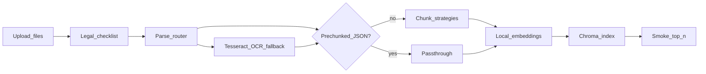

# Day 1 Offline Implementation Plan

**Handoff for the next agent — AI Clinical Decision Support Lite Hackathon**

This document is self-contained. Implement Day 1 from it without needing prior chat history.

| Reference | Path |
|-----------|------|
| Day 1 training deck | [`Day1 (1).pptx`](../Day1%20(1).pptx) |
| Topic research (orthogonal to ingest) | [`egypt-mena-topic-research.html`](../egypt-mena-topic-research.html) |

---

## 0. Mission

Build the **offline corpus factory** only:

**Upload ? legal gate ? parse (+ OCR fallback) ? chunk / passthrough ? embed ? Chroma ? smoke query (top-n)**

The system is **data-agnostic**: clinical topic lives in the corpus and metadata, not in hardcoded disease logic. Streamlit is a **team/dev Day 1 UI** to run ingest and verify the index — **not** the GTM patient/clinician product.

### Definition of done (Day 1)

1. Working **queryable vector index** built from uploaded sources  
2. Every indexed chunk carries **document_name**, **section_title**, **page_number**, **chunk_id** (plus supporting fields below)  
3. Short written note on **why** the chunk strategy and embedding model were chosen (saved in job report)  
4. **Smoke query** returns **sensible top-`n` chunks**, where **`n` is config-driven** (default `5`), each with score + citation metadata  
5. Streamlit UI can run the full offline path end-to-end  

### Explicit non-goals (Days 2–4)

| Later day | Do **not** build on Day 1 |
|-----------|---------------------------|
| Day 2 | Hybrid retrieval, RRF, rerank, Precision@K bakeoffs as product |
| Day 3 | Grounded LLM generation, citation formatting in answers, refusal UX |
| Day 4 | Full safety dashboard, faithfulness metrics suite |
| Product | End-user chunk-strategy picker; patient vs clinician chat modes |

Dev may expose strategy/embed knobs in Streamlit for **operator tuning**; freeze defaults later for end users.

---

## 1. Architecture



### Week map (context only)

| Day | Focus | This repo slice |
|-----|--------|-----------------|
| **1 — TODAY** | Ingest | This plan |
| 2 | Retrieval tune | Hybrid + RRF + rerank later |
| 3 | Generation | Grounded prompts + citations later |
| 4 | Safety & eval | Guardrails + faithfulness later |
| 5 | Demo | Frozen index + live cases |

### Deck rules that apply on Day 1

- Prefer **1–2** guideline documents for the competition build (depth > breadth)  
- Confirm **legal usability** before parsing  
- **Structure-aware** parsing (not naive text dump)  
- Chunk approaches: **Fixed / Section-aware / Hierarchical**; council start: **section-aware, 300–500 tokens, 10–15% overlap**  
- Local embeddings allowed (`sentence-transformers`)  
- Vector DB: start with **Chroma**  
- Citation fields designed **now** — do not retrofit on Day 3  
- Rule: **no claim without a citation** (doc + section + page) — metadata must make that possible  

---

## 2. Accepted file types

| Type | Role | Pipeline |
|------|------|----------|
| `.pdf` | Guidelines / reports | Structure-aware parse ? OCR fallback if needed ? chunk |
| `.md` | Text with headings | Light parse ? chunk (prefer section-aware) |
| `.txt` | Plain text | Parse ? chunk (fixed or section if detectable) |
| `.json` **raw doc** | Structured document | Normalize to pages/sections ? chunk |
| `.json` **pre-chunked** | Already chunked corpus | Validate schema ? **skip chunker** ? embed ? store |

### Pre-chunked vs raw JSON (fail closed)

**Detect pre-chunked** when the payload has a `chunks` array whose items include `text`.

Required pre-chunked shape:

```json
{
  "document_name": "Official Guideline Title",
  "source_url": "https://...",
  "chunks": [
    {
      "chunk_id": "doc-sec-001",
      "text": "...",
      "section_title": "Recommendation Summary",
      "page_number": 7
    }
  ]
}
```

- Missing `text` / `chunk_id` / `document_name` ? **reject** with clear error  
- Missing `page_number` or `section_title` ? allow only with explicit warning and `section_title="(unknown)"` where needed; PDFs from the PDF path must always have pages  
- Do **not** re-chunk pre-chunked data during strategy A/B (use `strategy_id=passthrough`)

Raw JSON example (non-chunked): title + `sections[]` or `pages[]` ? map to `ParsedDocument` ? run chosen chunk strategy.

---

## 3. Data contracts

Implement in `src/clinical_rag/schemas.py` (Pydantic).

### `RawDocument`

- `doc_id`, `filename`, `media_type` (`pdf|md|txt|json`)  
- `document_name`, `source_url`  
- `path` on disk  
- `legal`: `open_access_or_reusable`, `redistribution_ok_for_indexing`, `edition_current`, `attribution_documented` (all bool)

### `ParsedPage` / `ParsedDocument`

- `page_number`, `text`, `extraction_method` (`text|ocr|hybrid|n/a`)  
- optional structured `blocks` (heading / paragraph / table)  
- `warnings[]`

### `Chunk` (indexed unit)

**Required**

| Field | Notes |
|-------|--------|
| `chunk_id` | Stable unique id |
| `text` | Chunk body |
| `document_name` | Citation |
| `section_title` | Citation; `"(unknown)"` only as last resort |
| `page_number` | Required for PDF-derived chunks |
| `source_url` | Provenance |
| `strategy_id` | `fixed\|section_aware\|hierarchical\|passthrough` |
| `corpus_id` | Corpus namespace |
| `job_id` | Ingest run id |
| `extraction_method` | `text\|ocr\|hybrid\|n/a` |
| `token_count` | Int |
| `embed_model_id` | e.g. `BAAI/bge-m3` |

### `IngestJobConfig`

- `corpus_id`  
- file list  
- parser profile (default: PyMuPDF + OCR fallback)  
- chunk `strategy_id` + params  
- `embed_model_id`, `device`  
- Chroma persist dir + collection name  
- **`smoke_query.top_k` / `n`** (default **5**) — used by smoke query  

### Collection naming

```text
{corpus_id}__{strategy_id}__{embed_model_slug}
```

Keep strategies in **separate collections** so A/B compares stay fair.

---

## 4. Module design

### 4.1 Parse router

```text
by suffix + JSON detect
  pdf     ? PyMuPDF text
            ? per-page quality gate
            ? weak pages ? Tesseract OCR module
  md/txt  ? UTF-8 read; heading-aware where possible
  json    ? prechunked? ? validate ? Chunk[] 
            else ? normalize ? ParsedDocument ? chunk
```

### 4.2 CV / OCR module (parse sub-module — not a separate product path)

**Prefer Tesseract** (local, no API key).

| Step | Behavior |
|------|----------|
| Primary extract | PyMuPDF digital text layer |
| Quality gate | Per page: low char count, low alnum ratio, empty/near-empty ? OCR |
| Rasterize | PyMuPDF pixmap at ~200–300 DPI (avoid extra poppler dependency if possible) |
| OCR | `pytesseract` + system `tesseract`; default lang `eng` (hook for `ara` later) |
| Output | Text + **same `page_number`**; set `extraction_method=ocr` or `hybrid` |
| Tables/images | Best-effort text; log warnings — do not invent clinical meaning from figures |

Profiles for operator tuning (not end-user product):

- `text_only` — no OCR  
- `ocr_fallback` — **default**  
- `ocr_all` — full OCR (slow; scanned corpora)

### 4.3 Chunking

| `strategy_id` | Behavior | Default params |
|---------------|----------|----------------|
| `fixed` | Token windows | 400 tokens, ~12% overlap |
| `section_aware` | Headings ? pack to target (**deck default**) | target 400 (range 300–500), 10–15% overlap, min~120, max~520 |
| `hierarchical` | Parent/child; index children | child ~350, parent ~800 |
| `passthrough` | Pre-chunked JSON only | n/a |

Use `tiktoken` (or equivalent) for token counts. Keep heading text on section-aware chunks when possible.

### 4.4 Embeddings (local-first)

- Default: **`BAAI/bge-m3`** via `sentence-transformers`  
- Lighter fallback: `BAAI/bge-small-en-v1.5` if memory-constrained  
- Persist `embed_model_id` on every chunk and in the job report  
- **Smoke query must use the same embed model** as the index  

No required OpenAI/Cohere keys on Day 1.

### 4.5 Vector store

- **Chroma** persistent client under `artifacts/indexes/chroma/`  
- Upsert embedding + full metadata  
- Idempotent rebuild per job/collection policy (document in report)  
- Write `artifacts/jobs/<job_id>/report.json`

### 4.6 Smoke query (Day 1 verification)

**Not** “return one chunk.”

1. Read **`n` / `top_k` from config** (default `5`); Streamlit may override for the session  
2. Embed the query with the **same** model as the index  
3. Dense retrieve **top-n** from the active Chroma collection (or fewer if corpus smaller)  
4. Display for **each** hit: score, `document_name`, `section_title`, `page_number`, `chunk_id`, text excerpt  
5. Manual sanity: top hits should look relevant for a known test query  

No LLM generation on Day 1.

---

## 5. Streamlit UI (Day 1)

**Entry:** `src/clinical_rag/ui/streamlit_app.py`  
**Run:** `uv run streamlit run src/clinical_rag/ui/streamlit_app.py`

### Tabs

1. **Ingest**  
   - Multi-file uploader: pdf / md / txt / json  
   - Per-file: `document_name`, `source_url`, legal checkboxes  
   - Parser profile (default OCR fallback)  
   - Chunk strategy + params (dev)  
   - Embed model select  
   - **Build index** with progress (parse ? OCR pages ? chunk ? embed ? store)  
   - Summary: pages, OCR’d page count, chunk count, collection name  

2. **Browse chunks**  
   - Filter by document / strategy / `extraction_method`  
   - Inspect full metadata + text  

3. **Smoke query**  
   - Query box  
   - **`top_k` / `n`** widget (default from config)  
   - Results table for all returned hits  

4. **Job report**  
   - Show/download `report.json`  
   - Text area for chunk + embed **rationale** (DoD artifact)  

### UI rules

- Block build if legal checklist incomplete  
- Clear errors for invalid pre-chunked JSON  
- Surface OCR warnings prominently  

---

## 6. Suggested repo layout

```text
clinical-rag/
  pyproject.toml
  .env.example
  src/clinical_rag/
    __init__.py
    config.py                 # pydantic-settings: paths, device, smoke top_k
    schemas.py
    parsing/
      base.py
      router.py
      pdf_pymupdf.py
      pdf_ocr_tesseract.py
      text_plain.py
      json_doc.py
      json_prechunked.py
      quality.py
    chunking/
      base.py
      fixed.py
      section_aware.py
      hierarchical.py
      passthrough.py
    indexing/
      embed.py
      chroma_store.py
    pipeline/
      ingest.py
      smoke_query.py
    ui/
      streamlit_app.py
  data/
    uploads/                  # gitignore
    guidelines/
    eval/
  artifacts/
    indexes/chroma/
    jobs/
  scripts/
    build_index.py            # CLI twin of UI
  tests/
    test_schemas.py
    test_chunking.py
    test_json_modes.py
    test_ocr_gate.py
  docs/
    day1-offline-implementation-plan.md   # this file
```

Workspace today may use repo root `cursor_trial/`; place the package at repo root or under `clinical-rag/` consistently and keep imports coherent.

---

## 7. Implementation order

| Step | Task | Exit criteria |
|------|------|----------------|
| 1 | Scaffold package, schemas, settings, pyproject | Imports work |
| 2 | MD/TXT parse + fixed chunker + Chroma upsert | Smoke top-n on txt |
| 3 | Section-aware chunker | Headings reflected in `section_title` |
| 4 | PyMuPDF PDF parse | Digital PDF chunks have `page_number` |
| 5 | Quality gate + Tesseract fallback | Weak/image page yields OCR text + page |
| 6 | JSON raw + pre-chunked paths | Both modes green |
| 7 | Hierarchical chunker | Child chunks indexable |
| 8 | bge-m3 embed + smoke_query(top_k) | Sensible top-n hits |
| 9 | Streamlit four tabs | Full DoD via UI |
| 10 | Unit/integration tests | Schemas, JSON detect, OCR gate, chunk ids |
| 11 | 1–2 public guideline samples + rationale in report | Deck checklist |

---

## 8. Dependencies (lean, local-first)

- `pymupdf`  
- `pytesseract` + system package `tesseract-ocr` (+ `eng` lang data)  
- Prefer PyMuPDF page render over requiring poppler when possible  
- `tiktoken` (or equivalent)  
- `sentence-transformers`, `torch` (`cuda` / `mps` / `cpu`)  
- `chromadb`  
- `streamlit`  
- `pydantic`, `pydantic-settings`  

**Do not require** OpenAI, Cohere, LlamaParse, Pinecone, or Weaviate for Day 1.

---

## 9. Testing plan

- Unit: chunk boundaries, stable `chunk_id`, JSON mode detection  
- Unit: quality gate flags empty/low-text pages for OCR  
- Integration: small PDF ? all chunks have `page_number`  
- Integration: pre-chunked JSON ? passthrough ? smoke returns top-n  
- Manual: one clean digital PDF + one image-heavy/scanned page PDF  

---

## 10. Risks and mitigations

| Risk | Mitigation |
|------|------------|
| OCR latency | Per-page fallback only; cache OCR text under `artifacts/jobs/<id>/parsed/` |
| Broken tables | Warn + index best-effort text; don’t block ingest |
| Missing sections | Fallback `"(unknown)"`; prefer heading detection |
| Embed OOM | `batch_size` knob; bge-small fallback |
| Scope creep | 1–2 docs; no generation; no hybrid/RRF yet |

---

## 11. Acceptance checklist

- [ ] Legal checklist enforced before ingest  
- [ ] Accepts `pdf`, `md`, `txt`, `json` (raw and pre-chunked)  
- [ ] Structure-aware PDF parsing  
- [ ] Tesseract OCR fallback for weak/image pages (`extraction_method` tagged)  
- [ ] Chunk strategies: fixed, section_aware, hierarchical, passthrough  
- [ ] Chroma index with citation metadata on every chunk  
- [ ] Local embeddings (`bge-m3` default)  
- [ ] Streamlit: Ingest / Browse / Smoke / Report  
- [ ] **Smoke query returns sensible top-`n` chunks (`n` from config, default 5)** with scores + doc/section/page/chunk_id  
- [ ] Job report includes chunk + embed rationale  

---

## 12. Prompt starter for the next thread

Copy-paste:

```text
Implement Day 1 offline clinical RAG ingest per docs/day1-offline-implementation-plan.md.

Local-first:
- Parse: PyMuPDF + Tesseract OCR fallback (per-page quality gate)
- Chunk: section_aware default (also fixed + hierarchical for A/B); passthrough for pre-chunked JSON
- Embed: BAAI/bge-m3 via sentence-transformers
- Store: Chroma
- UI: Streamlit (Ingest / Browse / Smoke / Report)

File types: pdf, md, txt, json (raw doc or pre-chunked).

Smoke query: return top-n chunks where n is config-driven (default 5), each with score + document_name + section_title + page_number + chunk_id.

No generation, hybrid, RRF, or rerank yet.

Definition of done: queryable index + citation metadata + config-driven top-n smoke query + job report with strategy/embed rationale.
```

---

## 13. Config knobs the implementer should expose (settings, not a full sweep YAML)

Minimum settings object / env:

| Key | Example | Purpose |
|-----|---------|---------|
| `smoke_query.top_k` | `5` | **n** results for smoke query |
| `parser.profile` | `ocr_fallback` | text_only / ocr_fallback / ocr_all |
| `chunk.strategy_id` | `section_aware` | active strategy |
| `chunk.target_tokens` | `400` | section-aware / fixed size |
| `chunk.overlap_ratio` | `0.12` | 10–15% band |
| `embed.model_id` | `BAAI/bge-m3` | embedding model |
| `embed.device` | `cuda` \| `mps` \| `cpu` | hardware |
| `chroma.persist_dir` | `artifacts/indexes/chroma` | persistence |

Full combinatorial sweep YAML is **out of scope for Day 1 handoff**; operators can compare by running multiple jobs with different `strategy_id` / model settings into separate collections.

---

*End of handoff. Implement against this file; keep Day 1 scope tight.*
